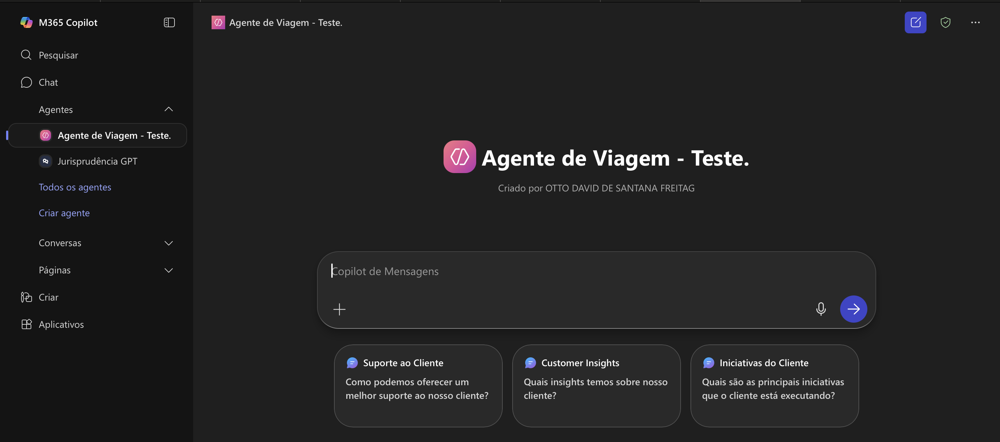

# Copilot Agent Test

## Sobre o Projeto

Este repositório foi criado como parte do **Boot Camp Suzano - Python Developer #2**, realizado em parceria com a [DIO (Digital Innovation One)](https://dio.me). O projeto representa o resultado prático do módulo dedicado ao estudo e implementação das funcionalidades do Microsoft 365 Copilot.

## Objetivos do Módulo

Durante este módulo, foi possível:

- 🤖 **Explorar as funcionalidades do M365 Copilot** - Compreender as capacidades e recursos disponíveis na plataforma
- 🔧 **Criar um agente de IA personalizado** - Desenvolver e configurar um agente especializado para casos de uso específicos
- 📚 **Aperfeiçoar habilidades adquiridas** - Consolidar conhecimentos através da prática e implementação real
- 🚀 **Aplicar conceitos de IA no ambiente corporativo** - Utilizar ferramentas modernas de inteligência artificial em contextos profissionais

## Demonstração

A imagem abaixo apresenta o agente de IA desenvolvido durante o projeto, demonstrando a interface e funcionalidades implementadas:

*Interface do Agente de Viagem desenvolvido no M365 Copilot, mostrando as funcionalidades de suporte ao cliente, insights e iniciativas implementadas.*

## Tecnologias Utilizadas

- Microsoft 365 Copilot
- Copilot Studio
- Inteligência Artificial
- Automação de Processos

## Resultados Obtidos

O projeto resultou na criação de um agente de IA funcional capaz de:

- Fornecer suporte especializado ao cliente
- Gerar insights relevantes sobre o negócio  
- Identificar e executar iniciativas estratégicas
- Automatizar processos de atendimento

## Sobre o Boot Camp

O **Boot Camp Suzano - Python Developer #2** é uma iniciativa educacional em parceria entre a Suzano e a DIO, focando no desenvolvimento de habilidades em Python e tecnologias emergentes como IA e automação.

## Autor

Desenvolvido como parte do aprendizado no Boot Camp Suzano - Python Developer #2.

---

*Este projeto faz parte do portfólio educacional desenvolvido durante o boot camp e representa a aplicação prática dos conhecimentos adquiridos em IA e automação.*
